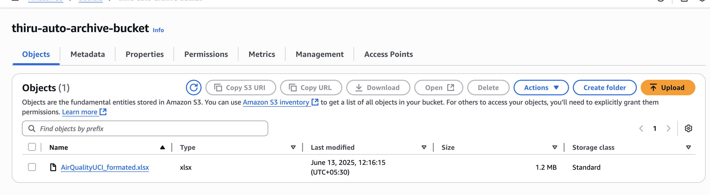
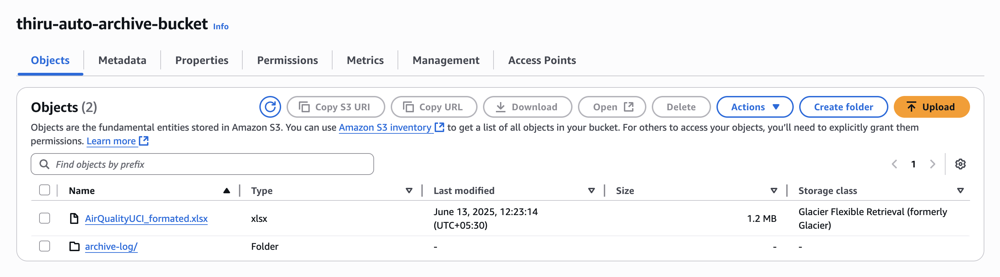
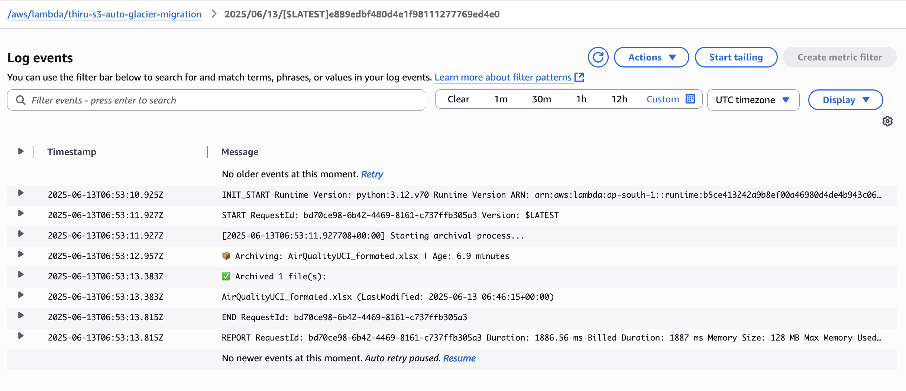
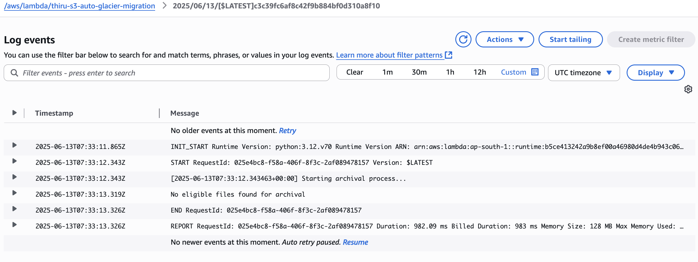

# 📦 Archive Old Files from S3 to Glacier Using AWS Lambda

## 🧾 Overview

This project automates the archival of files from an Amazon S3 bucket to the **Amazon S3 Glacier** storage class using an **AWS Lambda** function. Files older than a specified threshold (e.g., 180 days) are identified and re-stored as cost-effective Glacier objects.

Useful for reducing storage costs while retaining old data.

---

## 📌 Features

- ✅ Automatically scans S3 bucket contents
- 📅 Archives files older than a configurable number of **days**
- 💾 Changes storage class to **GLACIER**
- 📝 Logs actions to **CloudWatch Logs**
- 📁 Writes summary log files to an `archive-log/` folder in S3
- 🕒 Runs automatically **every 1 minute** via EventBridge (configurable)

---

## 🛠️ Prerequisites

- An AWS account
- An S3 bucket with uploaded files
- Permissions to create Lambda functions and IAM roles

---

## 🚀 Setup Instructions

### 1. Create an S3 Bucket

Create a bucket and upload some files to it. Ensure some are older than the configured archival period (default is 180 days).

> 🔧 For testing, you can lower the archival threshold to a few minutes.

---

### 2. Create IAM Role for Lambda

1. Go to **IAM > Roles > Create role**
2. Select **Lambda** as the trusted entity
3. Attach the policy: `AmazonS3FullAccess`
4. Name it `LambdaS3GlacierRole`

---

### 3. Create Lambda Function

- Runtime: **Python 3.10+**
- Role: **LambdaS3GlacierRole**
- Timeout: **1 minute**

Paste the [Lambda Function Code](#lambda-function-code) into the function editor.

---

### 4. Schedule the Lambda (Every Day at Midnight)

1. Open **Lambda > Select your function**
2. Click **Add trigger**
3. Choose **EventBridge (CloudWatch Events)**
4. Create a new rule with:

```
cron(0 0 * * ? *)
```

---

## Output 

### S3 Bucket - File In Standard Storage

The below file is in Standard storage class




### S3 Bucket - File Status updated to Glacier Flexible Retrieval (formerly Glacier)

The below file is now updated to **Glacier Flexible Retrieval (formerly Glacier)** after Lambda function trigger along with the Log file



### Cloud Watch Log

**Successful Arichival**

Cloud watch log output of each of the trigger of the lambda function. This is successful archival log format when the files is archived.




**No Eligible items for Arichival**

Cloud watch log output of each of the trigger of the lambda function. This is successful archival log format when there is no files eligible for archival. 


